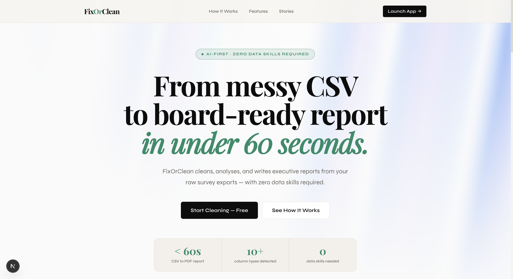
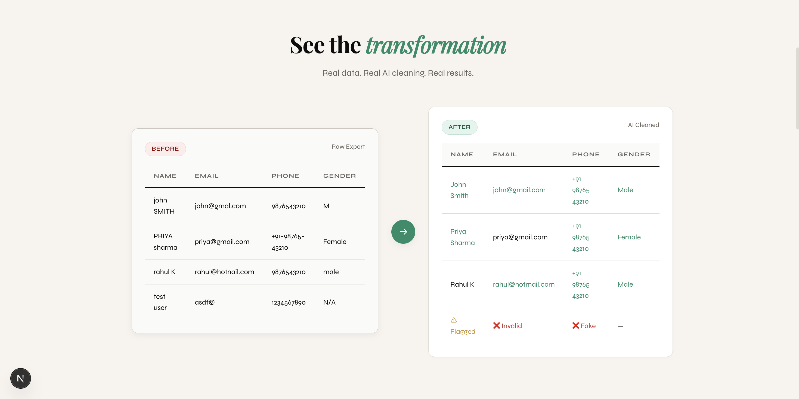
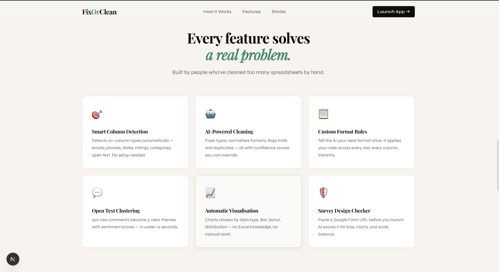

<div align="center">

# FixOrClean

### Turn messy Google Form exports into board-ready reports — in under 60 seconds.

[](https://nextjs.org)
[](https://typescriptlang.org)
[](https://ai.google.dev)
[](LICENSE)

<br/>



</div>

---

## The Story Behind It

I'm a college student. Every semester, my professors send out Google Form links — for attendance sheets, project preferences, lab partner selections, feedback surveys, you name it.

The problem? Students are inconsistent. One person writes their name as `abhinavmittal`, another as `Abhinav Mittal`, another as `ABHINAV`. Phone numbers come in as `9876543210`, `+91-9876543210`, or `98765 43210`. Dates show up in three different formats in the same column. Emails are misspelled. Required fields are left blank.

One day in class, my professor brought it up: *"It takes me an entire afternoon just to clean the data before I can even look at the results."*

That stuck with me. I went home and built **FixOrClean**.

It takes a raw CSV export from Google Forms, runs it through an AI cleaning pipeline, and hands back a polished dataset alongside a visual report — complete with quality scores, issue breakdowns, and column-by-column insights. What used to take a professor hours now takes under 60 seconds.

---

## What It Does

```
Raw Google Form CSV  →  AI Cleaning Engine  →  Clean Dataset + Visual Report
```

1. **Upload** your CSV export from Google Forms (or any form tool)
2. **AI analyzes** every column — types, patterns, common mistakes
3. **Cleaning happens automatically** — names normalized, phones standardized, emails fixed, dates unified, empty cells flagged
4. **Visual report generated** — quality scores, distribution charts, insights panel
5. **Export** the clean CSV and print the report as a PDF

---

### Before & After



---

## Features



| Feature | Description |
|---|---|
| **Smart Column Detection** | Automatically identifies name, email, phone, date, and free-text fields |
| **AI-Powered Cleaning** | Uses Gemini to understand intent, not just regex — handles ambiguous entries gracefully |
| **Quality Scoring** | Per-column and overall dataset quality scores (0–100) |
| **Audit Trail** | Every change logged with original value, new value, rule applied, and confidence |
| **Visual Dashboard** | Distribution charts, issue breakdowns, row-level drill-down |
| **PDF Report** | Print-optimized 1-page report for sharing with colleagues |
| **Design Check** | Flags structural issues in your form before you even collect data |
| **Fetch from URL** | Paste a Google Form link and pull the schema directly |

---

## Tech Stack

- **Framework:** Next.js 16 (App Router, Turbopack)
- **Language:** TypeScript
- **AI:** Google Gemini (`gemini-2.0-flash-exp`)
- **Charts:** Recharts
- **Animations:** Framer Motion
- **Database:** SQLite via Prisma (local MVP)
- **Styling:** CSS Modules + Tailwind CSS

---

## Getting Started

### Prerequisites

- Node.js 18+
- A [Google Gemini API key](https://aistudio.google.com/app/apikey)

### Installation

```bash
# Clone the repo
git clone https://github.com/abhinav-mittal33/fixorclean.git
cd fixorclean

# Install dependencies
npm install

# Set up environment variables
cp .env.example .env.local
# Add your Gemini API key to .env.local

# Set up the database
npx prisma generate
npx prisma db push

# Start the dev server
npm run dev
```

Open [http://localhost:3000](http://localhost:3000) and upload a CSV to get started.

### Environment Variables

```env
GEMINI_API_KEY=your_gemini_api_key_here
DATABASE_URL=file:./dev.db
```

---

## Project Structure

```
src/
├── app/
│   ├── page.tsx              # Landing page
│   ├── dashboard/
│   │   ├── page.tsx          # Dashboard route
│   │   └── DashboardClient.tsx  # Main app UI + report generation
│   └── api/
│       ├── upload/           # CSV ingestion
│       ├── clean/            # AI cleaning pipeline
│       ├── analyze/          # Quality scoring
│       ├── design-check/     # Form structure validation
│       └── fetch-form/       # Google Form URL scraping
├── lib/
│   ├── ai.ts                 # Gemini integration
│   ├── data-processing.ts    # CSV parsing & normalization
│   └── prisma.ts             # Database client
└── components/
    └── ui/
        └── aurora-background.tsx  # Animated hero background
```

---

## How the Cleaning Works

The AI pipeline runs in stages:

1. **Schema inference** — Gemini reads column headers and sample values to label each column's semantic type
2. **Rule generation** — Based on the type, appropriate cleaning rules are generated (e.g., phone normalization format, date target format)
3. **Row-by-row cleaning** — Each cell is evaluated; corrections are made with a confidence score
4. **Audit logging** — Every change is recorded so professors can review and approve/reject individual fixes
5. **Quality scoring** — Final scores calculated per column based on fix rate and confidence

---

## Roadmap

- [ ] Google Sheets direct integration (read/write)
- [ ] Shareable report links
- [ ] Multi-form comparison across semesters
- [ ] Custom cleaning rules (teach the AI your specific format requirements)
- [ ] Batch processing for multiple forms at once
- [ ] Email delivery of cleaned CSV

---

## Contributing

Contributions are welcome. Open an issue first to discuss what you'd like to change.

---

## License

MIT — free to use, fork, and build on.

---

<div align="center">

Built by a student, for professors. Made with frustration and ☕.

**[Live Demo](https://fixorclean.vercel.app)** · **[Report a Bug](https://github.com/abhinav-mittal33/fixorclean/issues)** · **[Request a Feature](https://github.com/abhinav-mittal33/fixorclean/issues)**

</div>
